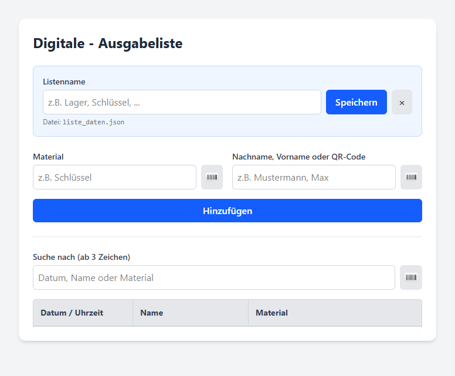

# Digitale Ausgabeliste

Eine leichtgewichtige, webbasierte Anwendung zur Erfassung und Verwaltung von Materialausgaben. Das System unterstützt die Barcode- und QR-Code-Erfassung direkt über die Kamera eines Smartphones oder Tablets und speichert alle Daten in benannten JSON-Dateien im Verzeichnis `data/`.



## Features

* **Barcode & QR-Code Scanner:** Integrierte Scan-Funktion (via `html5-qrcode`) für Materialien, Personennamen oder Suchbegriffe.
* **Intelligente Namenskonvertierung:** Erkennt Eingaben im Format `Nachname;Vorname`, formatiert sie automatisch in `Nachname, Vorname` um und wandelt die Anfangsbuchstaben in Großbuchstaben um (Title Case).
* **Live-Suche & Highlight:** Filtert die Liste ab dem 3. Zeichen in Echtzeit und springt per Autoscroll direkt zum ersten Treffer.
* **Clientseitige Sortierung:** Spalten (Datum, Name, Material) lassen sich per Klick auf- und absteigend sortieren (vollständige Unterstützung von deutschen Umlauten).
* **Responsive Design:** Optimiert für Smartphones, Tablets und Desktops dank Tailwind CSS v4.
* **Sicher & Konfliktfrei:** Schutz vor XSS-Angriffen und Verhinderung von Datenverlust bei gleichzeitigen Dateizugriffen durch exklusive PHP-Dateisperren (`LOCK_EX`).

## Voraussetzungen

* **Webserver** mit PHP 7.4 oder höher (z. B. Apache, Nginx).
* **HTTPS-Verbindung** (wird von modernen Browsern zwingend für den Zugriff auf die Kamera/den Scanner benötigt).
* Eine optionale Sounddatei namens `beep.ogg` im Hauptverzeichnis für akustisches Feedback beim Scannen.

## Installation & Struktur

1. Kopiere die Projektdateien auf deinen Webserver.
2. Stelle sicher, dass der Webserver Schreibrechte im `src/`-Verzeichnis besitzt, damit das Unterverzeichnis `data/` und die JSON-Dateien automatisch angelegt werden können.

## Docker
```text
docker compose up -d
```


**Verzeichnisstruktur:**
```text
├── src/
│   ├── index.php             # Hauptanwendung (Frontend & Backend-Logik)
│   ├── barcode.webp          # Icon für die Scan-Buttons und das Favicon
│   ├── beep.ogg              # (Optional) Audio-Feedback für den Scanner
│   └── data/                 # Automatisch generiertes Datenverzeichnis
│       ├── liste_daten.json  # Standard-Liste (kein Listenname gesetzt)
│       └── <name>_daten.json # Benannte Listen (z. B. lager_daten.json)
├── docker/
│   └── Dockerfile
└── docker-compose.yml
```

## Programmiert von:

- 👤**Dtrieb** - [https://www.github.com/dtrieb](https://www.github.com/dtrieb)
- 👤**dieterthiess**  - [https://www.github.com/dieterthiess](https://www.github.com/dieterthiess)
- 👤**Gemini & Claude Code**